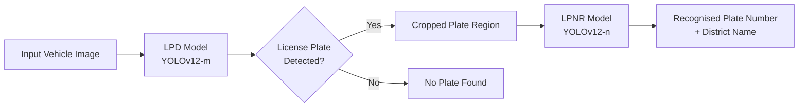

# 🚗 BLPD: Bangladeshi License Plate Detection & Recognition

A high‑performance dual‑model pipeline for **automatic Bangladeshi license plate detection (LPD)** and **license plate number recognition (LPNR)**. Both models are built with **YOLOv12** and achieve state‑of‑the‑art results on a large, diverse dataset collected from real‑world Bangladeshi traffic scenes.

[](https://colab.research.google.com/github/prosensarker4/BLPD/blob/main/BLPD_Result_Reproducibility.ipynb)

---

## 📌 Table of Contents

1. [Overview](#-overview)
2. [Pipeline Workflow](#-pipeline-workflow)
3. [Experimental Results](#-experimental-results)
   - [License Plate Detection (LPD)](#-license-plate-detection-lpd)
   - [License Plate Number Recognition (LPNR)](#-license-plate-number-recognition-lpnr)
4. [Reproducibility Instructions](#-reproducibility-instructions)
   - [Setup & Dependencies](#setup--dependencies)
   - [Validation & Test Execution](#validation--test-execution)
5. [Repository Structure](#-repository-structure)

---

## 🔍 Overview

The BLPD repository provides a complete end‑to‑end solution for detecting and reading Bangladeshi license plates. The system is divided into two stages:

| Stage | Model | Purpose | Dataset Size |
|-------|-------|---------|---------------|
| **LPD** | YOLOv12 | Localise the license plate region in a vehicle image | 213 images (test) / 425 images (val) |
| **LPNR** | YOLOv12 | Recognise the alphanumeric characters and district names on the plate | 721 images (test) / 1438 images (val) |

Both models have been trained on a large, custom‑collected dataset that captures the wide variety of license plate designs, fonts, and environmental conditions found on Bangladeshi roads.

---

## ⚙️ Pipeline Workflow

The system follows a simple two‑step pipeline:



1. **Detection (LPD)**: The input image is passed to the YOLOv12‑m model, which outputs the bounding box coordinates of the license plate (if present).
2. **Recognition (LPNR)**: The detected plate region is cropped and fed into the YOLOv12‑n model. This model recognises both the alphanumeric characters and the Bangla district name written on the plate.

> **Note**: The LPNR model uses a **two‑stage approach**: it first detects individual characters/district blocks, and then the recognised labels are concatenated to form the final plate string.

---

## 📊 Experimental Results

All metrics are reported on the **test splits** of the respective datasets.

### 🛑 License Plate Detection (LPD)

| Model | Split | Images | Instances | Precision (P) | Recall (R) | mAP<sub>50</sub> | mAP<sub>50‑95</sub> |
|-------|-------|--------|-----------|---------------|------------|------------------|---------------------|
| YOLOv12‑m | Val | 425 | 464 | 0.993 | 0.970 | **0.974** | 0.674 |
| YOLOv12‑m | Test | 213 | 226 | 0.986 | 0.965 | **0.963** | 0.685 |

> The LPD model achieves near‑perfect detection accuracy (mAP<sub>50</sub> > 96%) on both validation and test sets, demonstrating excellent generalisation to unseen vehicle images.

---

### 🔤 License Plate Number Recognition (LPNR)

The LPNR model recognises both numeric digits (0‑9) and Bangla district names. The table below summarises the overall performance, followed by a sample of the per‑class results.

| Model | Split | Images | Instances | Precision (P) | Recall (R) | mAP<sub>50</sub> | mAP<sub>50‑95</sub> |
|-------|-------|--------|-----------|---------------|------------|------------------|---------------------|
| YOLOv12‑n | Val | 1438 | 12488 | 0.952 | 0.905 | **0.950** | 0.768 |
| YOLOv12‑n | Test | 721 | 6292 | 0.950 | 0.898 | **0.949** | 0.767 |

#### Sample Per‑Class Performance (Validation Set)

| Class ID | Class Name | Images | Instances | P | R | mAP<sub>50</sub> | mAP<sub>50‑95</sub> |
|----------|------------|--------|-----------|----|----|------------------|---------------------|
| 0 | Digit 0 | 486 | 593 | 0.995 | 0.966 | 0.993 | 0.668 |
| 1 | Digit 1 | 931 | 1651 | 0.987 | 0.980 | 0.994 | 0.685 |
| ... | ... | ... | ... | ... | ... | ... | ... |
| Metro | Metro | 701 | 1036 | 0.997 | 0.990 | 0.994 | 0.886 |
| Dhaka | Dhaka | 559 | 792 | 0.994 | 0.973 | 0.992 | 0.865 |
| ... | ... | ... | ... | ... | ... | ... | ... |

*(Full per‑class results for all 116 classes are available in the validation output log.)*

> The LPNR model shows strong performance across both digits and Bangla district names, with many classes achieving mAP<sub>50</sub> > 0.99. The overall mAP<sub>50</sub> of **95%** on the test set confirms its robustness for real‑world deployment.

---

## 📋 Reproducibility Instructions

The entire validation/test pipeline is contained in a single Jupyter notebook:  
**`BLPD_Result_Reproducibility.ipynb`**.

### Setup & Dependencies

1. **Open the notebook in Google Colab** (recommended) or on a local machine with a CUDA‑capable GPU.
2. The first two cells will automatically:
   - Clone the BLPD repository (size ~488 MB).
   - Install `ultralytics` (YOLOv12) and its dependencies (Torch, OpenCV, etc.).
3. No manual configuration is required – the notebook uses the pre‑trained model files already in the repository (`LPD_Model.pt` and `LPNR_Model.pt`).

### Validation & Test Execution

The notebook is divided into four sequential sections. **Run each code cell in order**:

| Section | Model | Split | Command Description |
|---------|-------|-------|---------------------|
| 1 | **LPD** | Val | `model.val(data='.../LPD_data.yaml', split='val')` |
| 2 | **LPD** | Test | `model.val(data='.../LPD_data.yaml', split='test')` |
| 3 | **LPNR** | Val | `model.val(data='.../LPNR_data.yaml', split='val')` |
| 4 | **LPNR** | Test | `model.val(data='.../LPNR_data.yaml', split='test')` |

> ⚠️ **Note:** The notebook uses the `save=False` flag to avoid storing thousands of prediction images. If you wish to visualise the bounding boxes on the test images, change this to `save=True`. The output will be saved to `/content/runs/detect/`.

#### Expected Outputs

Running each cell will produce console output similar to the snippets shown in the Results section. The final line of each cell will indicate the saved results directory.

### 🚀 One‑Click Reproduction

Simply click the **Open In Colab** badge at the top of this README, then run all cells in order. No additional steps are required.

---

## 📁 Repository Structure

```
BLPD/
│
├── BLPD_Result_Reproducibility.ipynb   # Main reproducibility notebook
├── LPD_Model.pt                        # Pre‑trained detection model (YOLOv12‑m)
├── LPNR_Model.pt                       # Pre‑trained recognition model (YOLOv12‑n)
├── LPD_data.yaml                       # Dataset configuration for detection
├── LPNR_data.yaml                      # Dataset configuration for recognition
├── LPD_Dataset/                        # Detection dataset (train/val/test splits)
├── LPNR_Dataset/                       # Recognition dataset (train/val/test splits)
└── External Validated Images/          # Additional test images for qualitative evaluation
```

> **Total repository size:** ~488 MB (including datasets and model weights).

---


## 📬 Contact

For questions or collaboration, please open an issue on the [GitHub repository](https://github.com/prosensarker4/BLPD) or contact the author directly.

---

**⭐ If you find this work useful, please consider giving a star on GitHub!**
